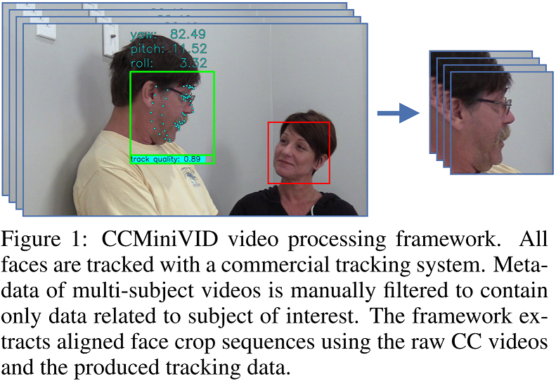

## Let Me Take a Better Look: Towards Video-based Age Estimation

This readme provides instructions on how to reproduce the image-based benchmark data (CCMiniIMG)
and the video-based benchmark data (CCMiniVID-O, CCMiniVID-A, and CCMiniVID-R) used in our work [2]. 
Moreower, it provides instructions on how to run the benchmark evaluation protocol in order to 
reproduce the main results reported in our work or to perform evaluation of some other methods.

Figure 1 taken from our work [2]




### 1. Reproducing CCMiniIMG benchmark data

CCMiniIMG is the image-based age estimation benchmark dataset proposed in [1] and used in 
our work, based on the raw frames from the 
[Casual Conversations Mini dataset](https://ai.meta.com/datasets/casual-conversations-dataset/). 

To reproduce the full CCMiniIMG benchmark data used in our work, please follow these steps:
1. Download the [DLIB face detection metadata](https://ferhr-my.sharepoint.com/:u:/g/personal/kbr122017_fer_hr/EemyxVpcFQhAnvfpEVt7-UgBevuTdbjRHhakEczPU9X-Vg?e=zn8uxl) 
   from our work and place it under `benchmark_data/CCMiniIMG/` or specify the path via the 
   `detection_data_path` argument
2. Download the raw 
   [Casual Conversations Mini frames](https://ai.meta.com/datasets/casual-conversations-downloads/)  
   and place them under `benchmark_data/CCMiniIMG/raw_frames/` or specify the path via the
   `raw_frames_root` argument
3. Run `benchmark_framework/extract_img_data.py`, following this example:
```shell
python benchmark_framework/extract_img_data.py --detection_data_path benchmark_data/CCMiniIMG/dlib_detections.json --raw_frames_root benchmark_data/CCMiniIMG/raw_frames --cropped_faces_root benchmark_data/CCMiniIMG/crops
```
The aligned face crops will be serialized under the specified `cropped_faces_root` path.

More protocol reproduction details are available in Appendix A.

### 2. Reproducing CCMiniVID benchmark data

CCMiniVID is the set of video-based age estimation benchmark datasets proposed in our work, 
based on the raw videos from the 
[Casual Conversations dataset](https://ai.meta.com/datasets/casual-conversations-dataset/).

To reproduce CCMiniVID-O or CCMiniVID-A benchmark dataset versions, please follow these steps:
1. Download the [face tracking data](https://ferhr-my.sharepoint.com/:u:/g/personal/kbr122017_fer_hr/EcPrEojSd31Dvxn9SYIPxRcB5b58yyCPd3zetpnwc1MIow?e=EnrmmP) 
   from our work and and place it under `benchmark_data/CCMiniVID/tracking_data` or specify the path
   via the `track_data_root` argument
2. Download the raw 
   [Casual Conversations videos*](https://ai.meta.com/datasets/casual-conversations-downloads/) 
   and place them under `benchmark_data/CCMiniVID/raw_videos/` or specify the path via the
   `raw_videos_root` argument 
3. Run `benchmark_framework/extract_vid_data.py`, following one of these examples:

CCMiniVID-O:
```shell
python benchmark_framework/extract_vid_data.py --metadata_path benchmark_data/CCMiniVID/CCMiniVID-O_metadata.json --track_data_root benchmark_data/CCMiniVID/tracking_data --raw_videos_root benchmark_data/CCMiniVID/raw_videos --cropped_faces_root benchmark_data/CCMiniVID/crops/CCMiniVID-O --crop_size 256
```
CCMiniVID-A:
```shell
python benchmark_framework/extract_vid_data.py --metadata_path benchmark_data/CCMiniVID/CCMiniVID-A_metadata.json --track_data_root benchmark_data/CCMiniVID/tracking_data --raw_videos_root benchmark_data/CCMiniVID/raw_videos --cropped_faces_root benchmark_data/CCMiniVID/crops/CCMiniVID-A --crop_size 256
```

The aligned face crops will be serialized under the specified `cropped_faces_root` path.

The CCMiniVID-R dataset version doesn't need to be extracted separately since it is a subset of 
CCMiniVID-O.

More details on the CCMiniVID benchmark data and its version are available in Section 3.2. 

_*NOTE: To generate face crops for CCMiniVID-O and CCMiniVID-R versions, you can download only 
the Mini subset of the Casual Conversations dataset. CCMiniVID-A requires some videos from the 
full dataset._

### 3. Video-based benchmark protocol

Details of the proposed video-based benchmark protocol are provided in Section 4.2. 
To run the evaluation protocol, users need to provide a csv file containing their 
age estimations for each of the frames from the benchmark data that were processed by 
their estimation method.

An example of such csv file, produced by our best performing "2D CNN + TCN4" model on the 
CCMiniVID-A benchmark data is available under `evaluation_data/CCMiniVID-A_TCN4_estimations.csv`.
The csv needs to contain a header and path-age pairs, following this example:
```
path , age
CCMiniVID-A/1/1140_00/0000.jpg , 39.055419921875
...
```

To run the benchmark protocol and to reproduce the reported results for the "2D CNN + TCN4" 
model, please follow these steps:
1. Download the [csv file containing model's estimations](https://ferhr-my.sharepoint.com/:x:/g/personal/kbr122017_fer_hr/EbOB3Z7SGGhMiFKN8nyc0-YBoFkDADt31msfyYWcuZq1EA?e=OGrV9q) 
   and specify its path via the `estimation_data_path` argument
2. Run `benchmark_framework/evaluate.py`, following this example:
```shell
python benchmark_framework/evaluate.py --metadata_path benchmark_data/CCMiniVID/CCMiniVID-A_metadata.json --estimation_data_path evaluation_data/CCMiniVID-A_TCN4_estimations.csv --output_results_path evaluation_data/CCMiniVID-A_TCN4_metrics.json
```
The generated protocol metrics in form of a json file will be available under the 
specified `output_results_path` path.

_NOTE: To run the benchmark protocol for some other method, generate the benchmark data following 
the instructions from the previous section, generate the csv file described in this section, and 
change the `estimation_data_path` argument, specifying path to the generated csv file 
containing method's frame-level estimations._

Example output is available under `evaluation_data/CCMiniVID-A_TCN4_metrics.json`:
```json
{
  "Offline": {
    "MAE": {
      "Overall": 4.947238485705614,
      "Female": 5.253857178962362,
      "Male": 4.575583118397608,
      "Other": 3.8075745701789856,
      "SkinType1": 4.712663218892854,
      "SkinType2": 4.494545411605102,
      "SkinType3": 4.757895366160455,
      "SkinType4": 4.827981958505113,
      "SkinType5": 5.272260744860218,
      "SkinType6": 5.60854490946948,
      "Bright": 4.756821038145008,
      "Dark": 5.266849242374098
    }
  },
  "Online": {
    "tMAE": {
      "Overall": 5.156563644696996,
      "Female": 5.519800410807643,
      "Male": 4.713606083387591,
      "Other": 4.02362591445446,
      "SkinType1": 4.965957563170072,
      "SkinType2": 4.692002663784302,
      "SkinType3": 4.937220426976324,
      "SkinType4": 5.001590767794775,
      "SkinType5": 5.517562789957489,
      "SkinType6": 5.845009196227159,
      "Bright": 4.955468452477352,
      "Dark": 5.494096719376289
    },
    "tSTD": {
      "Overall": 1.511326551010613,
      "Female": 1.737831360219103,
      "Male": 1.2278126218321646,
      "Other": 1.397310035768814,
      "SkinType1": 1.5325003714947956,
      "SkinType2": 1.3965089356103695,
      "SkinType3": 1.41641174443809,
      "SkinType4": 1.3710212007399798,
      "SkinType5": 1.6710677761984485,
      "SkinType6": 1.6997696210604638,
      "Bright": 1.4444785319446187,
      "Dark": 1.6235292206145704
    }
  }
}
```

### References

[1] Towards measuring fairness in ai: the casual conversations dataset
```
@article{hazirbas2021towards,
  title={Towards measuring fairness in ai: the casual conversations dataset},
  author={Hazirbas, Caner and Bitton, Joanna and Dolhansky, Brian and Pan, Jacqueline and Gordo, Albert and Ferrer, Cristian Canton},
  journal={IEEE Transactions on Biometrics, Behavior, and Identity Science},
  volume={4},
  number={3},
  pages={324--332},
  year={2021},
  publisher={IEEE}
}
```

[2] Let Me Take a Better Look: Towards Video-based Age Estimation
```
BibTeX not available, to be added
```